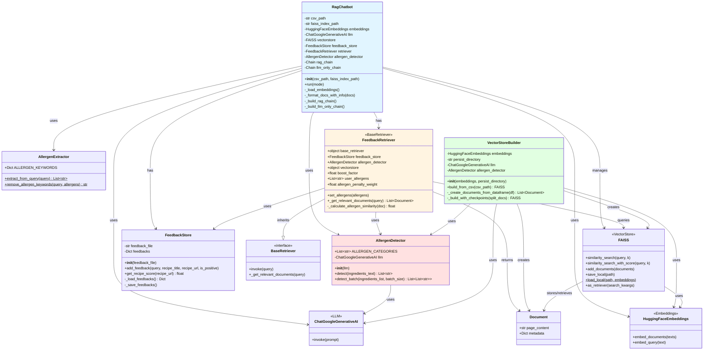

# RAG Chatbot 클래스 다이어그램



## 클래스별 역할

### 🎯 **핵심 클래스**

#### **RagChatbot**
- **역할**: 전체 시스템의 진입점이자 오케스트레이터
- **주요 기능**:
  - 벡터 저장소, LLM, Retriever 초기화 및 관리
  - RAG 체인과 LLM 전용 체인 구성
  - 사용자 인터페이스 제공 (run 메서드)
  - 알레르기 정보 추출 및 검색 쿼리 전처리

---

### 🔍 **검색 및 재정렬**

#### **FeedbackRetriever**
- **역할**: 피드백과 알레르기를 고려한 지능형 검색기
- **상속**: `BaseRetriever` (LangChain)
- **주요 기능**:
  - 벡터 검색 수행
  - 알레르기 필터링 (post-filtering)
  - 피드백 기반 점수 재정렬
  - 다양성 노이즈 추가

---

### 🚫 **알레르기 관리**

#### **AllergenDetector**
- **역할**: LLM 기반 알레르기 성분 탐지
- **주요 기능**:
  - 재료 텍스트에서 19가지 법정 알레르기 항목 탐지
  - 배치 처리로 효율적인 대량 분석
  - 가공식품 원재료 분석 (간장→대두, 마요네즈→알류 등)

#### **AllergenExtractor**
- **역할**: 사용자 질문에서 알레르기 정보 추출
- **주요 기능**:
  - 정규식 기반 알레르기 키워드 파싱
  - 검색 쿼리 전처리 (알레르기 키워드 제거)
  - 정적 메서드만 제공 (유틸리티 클래스)

---

### 💾 **데이터 관리**

#### **FeedbackStore**
- **역할**: 사용자 피드백 저장 및 관리
- **주요 기능**:
  - JSON 파일로 피드백 영구 저장
  - 레시피별 점수 계산 (긍정: +1, 부정: -1)
  - 검색 결과 재정렬에 활용

#### **VectorStoreBuilder**
- **역할**: 벡터 저장소 구축 파이프라인
- **주요 기능**:
  - CSV에서 Document 생성
  - LLM 배치 처리로 알레르기 정보 추출
  - 체크포인트 기반 임베딩 생성
  - FAISS 인덱스 저장

---

### 📦 **외부 의존성**

#### **FAISS** (LangChain Community)
- 벡터 임베딩 저장 및 유사도 검색
- 메타데이터 포함 Document 관리

#### **ChatGoogleGenerativeAI** (LangChain Google GenAI)
- Gemini 2.5 Flash 모델 사용
- 알레르기 탐지 및 레시피 생성

#### **HuggingFaceEmbeddings** (LangChain HuggingFace)
- 한국어 임베딩 모델 (jhgan/ko-sroberta-multitask)
- 텍스트를 벡터로 변환

---

## 🔄 데이터 흐름

### 1️⃣ **초기화 단계**
```
CSV 파일
  ↓
VectorStoreBuilder
  ├─ AllergenDetector (LLM 배치 분석)
  └─ Document 생성 (알레르기 메타데이터 포함)
  ↓
FAISS 벡터 저장소
  ↓
RagChatbot 초기화
```

### 2️⃣ **질문 처리 단계**
```
사용자 질문
  ↓
AllergenExtractor (알레르기 추출 & 쿼리 정제)
  ↓
FeedbackRetriever
  ├─ FAISS 벡터 검색 (후보 20배 검색)
  ├─ 알레르기 필터링 (post-filtering)
  ├─ 피드백 점수 적용
  └─ 다양성 노이즈 추가
  ↓
상위 K개 Document 반환
  ↓
RAG Chain (프롬프트 + LLM)
  ↓
최종 답변
```

### 3️⃣ **피드백 수집**
```
사용자 피드백 (👍/👎)
  ↓
FeedbackStore (JSON 저장)
  ↓
다음 검색 시 점수 반영
```

---

## 📊 클래스 간 의존성 요약

| 클래스 | 의존 클래스 | 관계 |
|--------|------------|------|
| **RagChatbot** | AllergenDetector, FeedbackStore, FeedbackRetriever, FAISS, LLM, Embeddings, AllergenExtractor | 모든 컴포넌트 통합 |
| **FeedbackRetriever** | FeedbackStore, AllergenDetector, FAISS, BaseRetriever | 검색 + 필터링 + 재정렬 |
| **VectorStoreBuilder** | AllergenDetector, FAISS, Embeddings, LLM | 벡터 저장소 구축 |
| **AllergenDetector** | LLM | LLM 기반 분석 |
| **AllergenExtractor** | (독립적) | 정적 유틸리티 |
| **FeedbackStore** | (독립적) | 파일 시스템만 사용 |

---

## 🎨 설계 특징

1. **단일 책임 원칙**: 각 클래스가 명확한 단일 책임을 가짐
2. **의존성 주입**: 생성자를 통해 의존성 전달 (테스트 용이)
3. **체크포인트 시스템**: 대용량 데이터 처리 중단 시 재시작 가능
4. **Post-filtering 패턴**: FAISS 한계를 Python 레벨에서 보완
5. **배치 처리**: LLM API 호출 최적화 (RPM 제한 준수)
6. **메타데이터 활용**: 알레르기 정보를 Document 메타데이터에 저장

---

## 🚀 확장 가능성

- **다른 벡터 DB 사용**: FAISS → Pinecone/Weaviate (네이티브 필터링 지원)
- **다른 LLM 사용**: Gemini → GPT-4/Claude (AllergenDetector만 수정)
- **추가 필터**: 난이도, 조리시간, 카테고리 등
- **실시간 학습**: 피드백 기반 모델 파인튜닝
